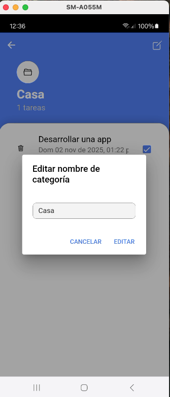
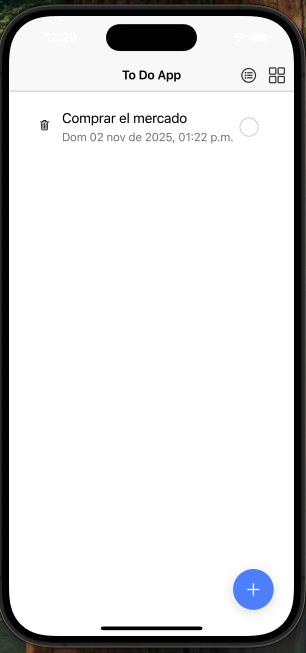

# ToDo App
ToDo App es una aplicación de gestión de tareas desarrollada con Ionic + Angular, diseñada para ofrecer una experiencia rápida, simple y eficiente tanto en dispositivos Android como iOS.

Esta aplicación permite a los usuarios:

- Crear y organizar tareas personales.
- Agrupar tareas por categorías personalizadas.
- Marcar tareas como completadas o expiradas automáticamente según su fecha límite.
- Funciona completamente sin conexión, usando almacenamiento local (@ionic/storage-angular).

Su diseño fue pensado para ofrecer una interfaz clara, minimalista y fácil de usar, ideal para el día a día. La app es multiplataforma y aprovecha las capacidades nativas de cada sistema operativo.

## Tabla de contenido

1. [Cómo ejecutar la app](#cómo-ejecutar-la-app)  
2. [Capturas de pantalla](#capturas-de-pantalla)  
3. [Video Remote Config](#conexion-firebase-remote-config)  
4. [Descargables (APK e IPA)](#descargables)
5. [Respuestas a las preguntas](#respuestas-a-las-preguntas)

## Cómo ejecutar la aplicación 
### Requisitos previos

Asegúrate de tener instalados los siguientes elementos:

- Node.js (versión recomendada v20.19.4)
- Ionic CLI
- Cordova CLI
- Android Studio (para compilar y ejecutar en Android)
- Xcode (para compilar y ejecutar en iOS, solo en macOS)

### Paso a paso
1. Clonar el repositorio
```bash
git clone https://github.com/juanjmorelos/ionic-todo-app
```
2. Intalar las dependecias
```bash
npm install --legacy-peer-deps
```
3. Construir la aplicación
```bash
ionic build
cordova plugin save
```
4. Agregar las dos plataformas
  - Para android
    ```bash
    cordova platform add android
    ```
  - Para iOS (solo en macOS)
    ```bash
    cordova platform add ios
    ```
5. En este momento puedes ejecutar la aplicación:
  - En el navegador:
    ```bash
    npm start
    ```
  - En android:
    ```bash
    cordova build android
    # Luego abre android studio y abres el proyecto ubicado en platforms/android
    ```
  - En ios:
      - Abre el archivo `platforms/ios/Podfile`:
        ```bash
        #La línea
        platform :ios, '11.0'

        #Cambiala a
        platform :ios, '13.0'
        ```
      - Luego ejecuta
        ```bash
        cd platforms/ios
        pod install
        cd ../..
        cordova build ios
        open "platforms/ios/ToDo App.xcworkspace" 
        ```
      - Compila el proyecto en Xcode 
## Capturas de pantalla
A continuación se muestran capturas de pantalla de la aplicación funcionando tanto en android como iOS

### Android

<p align="start">
  
  
  
  
</p>
<p align="start">
  
  
  
  
</p>
<p align="start">
  
  
</p>

### iOS

<p align="start">
  
  
  
  
</p>
<p align="start">
  
  
  
  
</p>
<p align="start">
  
  
</p>

## Conexion Firebase Remote Config
### Android
[Descargar video](https://github.com/juanjmorelos/ionic-todo-app/blob/main/media/videos/remote_config_android.mov)
### iOS
[Descargar video](https://github.com/juanjmorelos/ionic-todo-app/blob/main/media/videos/remote_config_ios.mov)

## Descagables
- [Descargar APK](https://github.com/juanjmorelos/ionic-todo-app/blob/main/media/release/todo-app.apk)
- [Descargar IPA](https://github.com/juanjmorelos/ionic-todo-app/blob/main/media/release/todo-app.ipa)

## Respuestas a las preguntas
- ***¿Cuáles fueron los principales desafíos que enfrentaste al implementar las nuevas funcionalidades?***
R/ Uno de los principales retos fue utilzar cordova en lugar de capacitor que es el recomendado por el propio desarrollador de ionic, cordova me generaba conflictos con versiones de angular tanto que me hizo bajar hasta Angular 16
- ***¿Qué técnicas de optimización de rendimiento aplicaste y por qué?***
R/ Se empleó `@ionic/storage-angular` para guardar datos localmente sin requerir constantemente accesos a recursos externos. Esto mejora el rendimiento en dispositivos móviles. Se diseñaron estructuras reactivas pero controladas con
`ngIf`, `ngFor`, etc. para evitar renderizados innecesarios. Se utilizaron componentes reutilizables centralizando la lógica y evitando el código duplicado.
- ***¿Cómo aseguraste la calidad y mantenibilidad del código?*** R/ Se implemenataron interfaces (`Category` y `UserTask`) para asegurar que los datos tenga siempre una estructura consistente. Se separaron las responsabilidades, la lógica
del negocio se separo en servicios `StorageService`. Se utilizó *Conventional Commits* para mantener un historial de cambios claros.

